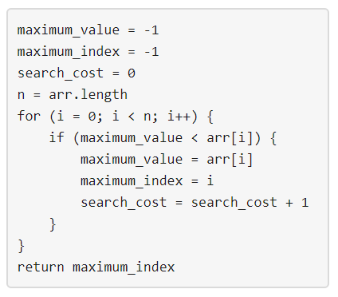

# 1420. Build Array Where You Can Find The Maximum Exactly K Comparisons

## Hard

You are given three integers `n`, `m` and `k`. Consider the following algorithm to find the maximum element of an array
of positive integers: 

You should build the array `arr` which has the following properties:

- `arr` has exactly `n` integers.
- `1 <= arr[i] <= m` where (`0 <= i < n`).
- After applying the mentioned algorithm to `arr`, the value `search_cost` is equal to `k`.

Return the number of ways to build the array `arr` under the mentioned conditions. As the answer may grow large, the
answer must be computed modulo `10^9 + 7`.

### Constraints:

– `1 <= n <= 50`
– `1 <= m <= 100`
– `0 <= k <= n`
