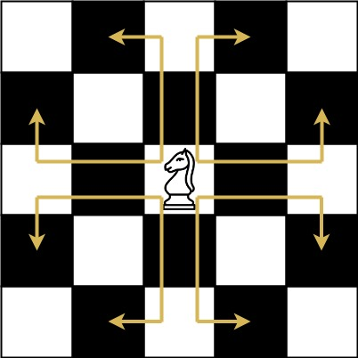
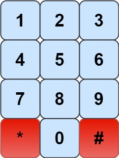

# 935. Knight Dialer

## Medium

The chess knight has a unique movement, it may move two squares vertically and one square horizontally, or two squares
horizontally and one square vertically (with both forming the shape of an L). The possible movements of chess knight are
shown in this diagram. A chess knight can move as indicated in the chess diagram below . We have a
chess knight and a phone pad as shown below, the knight can only stand on a numeric cell (i.e. blue cell) . Given an
integer `n`, return how many distinct phone numbers of length `n` we can dial. You are allowed to place the knight on
any numeric cell initially and then you should perform `n - 1` jumps to dial a number of length `n`. All jumps should be
valid knight jumps. As the answer may be very large, return the answer modulo `10^9 + 7`

### Constraints:

- `1 <= n <= 5000`
